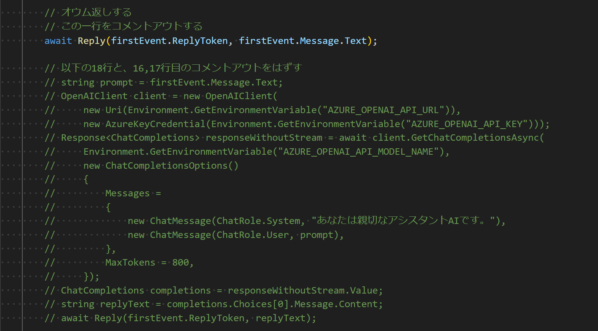
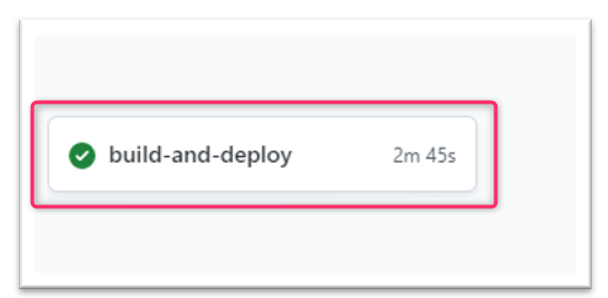

# 3. 返答内容の変更と再デプロイ
## 3-1. LINEの返答内容を変更
LINEで送信したメッセージに対してAzure OpenAI Serviceが返信するように変更します。  

> ここで本来は、nugetでAzure.AI.OpenAIのパッケージをインストールする手順が必要ですが、今回はすでに追加されています。  
> https://www.nuget.org/packages/Azure.AI.OpenAI/1.0.0-beta.6

まず、VSCodeで`Functions/Webhook.cs`ファイルを開きます。  
コードの中に**オウム返しをする**というコメントがあります。近くに`コメントアウトする`と`コメントアウトをはずす`という記載がありますので、内容に従って作業し、コードを保存します。  
  

## 3-2. 再デプロイ
ターミナルで下記のコマンドを実行し、GitHubにpushします。  
```
git add .  
git commit -m "Update OpenAI Chat"
git push origin main 
```

次にGitHub Actionsの実行結果を確認します。  
ご自身のGitHubリポジトリページから「Actions」タブを開きます。  
ビルドとデプロイができているか確認し、緑のチェックマークになっていれば再ビルドと再デプロイが成功です。  


## 3-3. 環境変数の設定
使用するOpenAI Serviceを下記手順でAzure Functionsに設定します。
- 先に作成しておいたFunctionsのリソースへ移動
- リソース画面の左サイドメニューにある設定→構成へ移動
- アプリケーション設定に「新しいアプリケーション設定」を追加
    - `AZURE_OPENAI_API_KEY` : OpenAI Service のキー,
    - `AZURE_OPENAI_API_URL` : OpenAI Service のエンドポイント,
    - `AZURE_OPENAI_API_DEPLOY_NAME` : OpenAI Service のデプロイ名,
- 「保存」ボタンを押下
  
  
## 3-4. LINEで返答確認  
LINEで返信が変わっているか確認します。  
先ほどは送信メッセージと同じメッセージが返ってきていました。  
LINEでメッセージを入力し、送信します。 AIチャットボットから返信がきたら成功です。  


ハンズオンの内容は以上になります。  
お疲れ様でした:blush:

## ハンズオン終了後
**今回のハンズオンが終了したら、Azureポータルからハンズオン用に作成した全てのリソースグループを削除してください。**  
（※弊社よりハンズオン用環境を払い出ししている場合は一旦削除せず、スタッフにご確認ください。）
  

時間が余った方は、ローカルデバッグにチャレンジしてみましょう！「[（上級編）Dev Containersとngrokを使ってローカルデバッグを行う](/docs/4-document-suppliment.md)」
