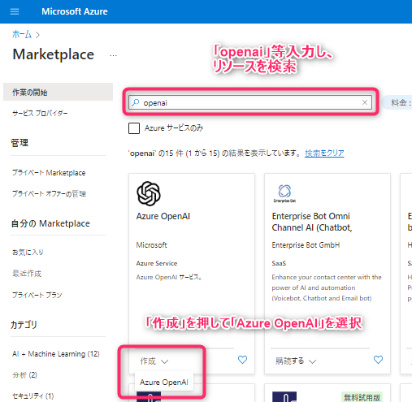
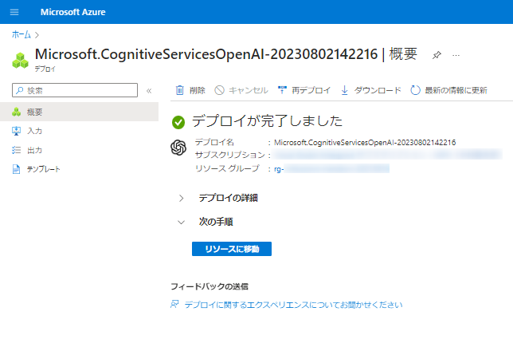
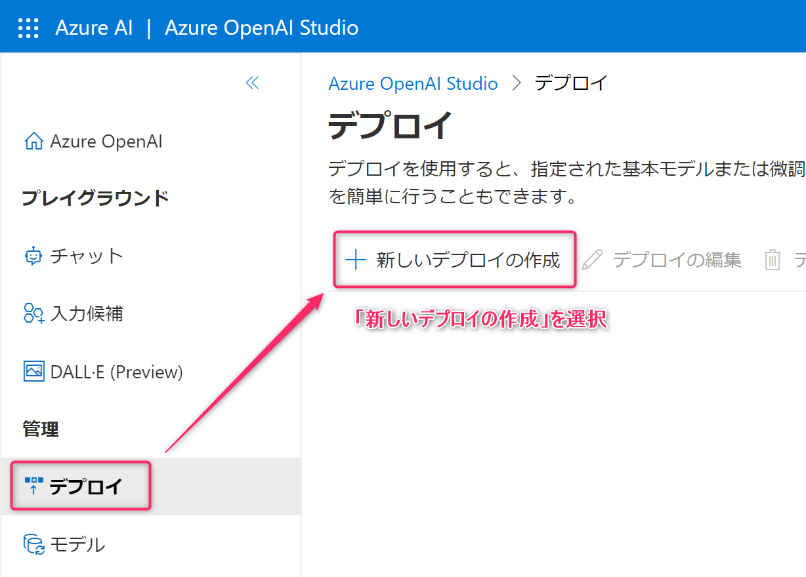
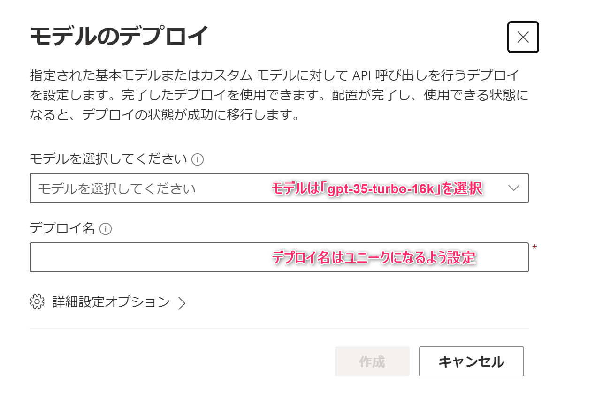

# 3. 返答内容の変更と再デプロイ
## 3-1. Azure OpenAIリソースの作成
はじめに、Azure OpenAIリソースを作成します。  
[Azureポータル](https://portal.azure.com) に移動し、[前章](/docs/2-functions-create.md##2-1-Functionsリソース作成)で作成したリソースグループを開き、「作成」ボタンを選択します。  
  
  
検索バーに「openai」等を入力し、Azure OpenAIリソースを検索し、「作成」のプルダウンメニューから「Azure OpenAI」を選択しリソースを作成します。  
  
  
下記スクリーンショットに倣って情報を入力します。  
入力後確認および作成の画面で「作成」へと移ってください。  
  
  
以下のように「デプロイが完了しました」と表示されれば、Azure OpenAIリソース作成完了です。  
  
  
## 3-2. モデルのデプロイ
[前節](#3-1-azure-openaiリソースの作成)で作成したAzure OpenAIリソースを開き、「探索」を選択します。
  
  
「デプロイ」タブへと移動し、「新しいデプロイの作成」を選択します。
  
  
下記スクリーンショットに倣って情報を入力します。  
入力後、「作成」を選択します。
  
  
以下のように作成したモデルが表示されれば、モデルのデプロイ作成完了です。
  
  
## 3-3. エンドポイントとキーの確認
右上の「歯車アイコン⚙」を選択し、「Resource」タブへと移動します。  
   
  
作成したOpenAIリソースのエンドポイントとキーはこのページで確認できます。
[次節](#3-4-環境変数の設定)で必要となるため、「Endpoint」、「Key」の値を控えておきます。
   
  
## 3-4. 環境変数の設定
使用するAzure OpenAIリソースを下記手順でAzure Functionsに設定します。  
- [前章](/docs/2-functions-create.md##2-1-Functionsリソース作成)で作成したFunctionsのリソースへ移動
- リソース画面の左サイドメニューにある設定カテゴリ→「構成」タブへ移動
- アプリケーション設定に「新しいアプリケーション設定」を追加
    - `AZURE_OPENAI_API_KEY` : OpenAI Service のキー,
    - `AZURE_OPENAI_API_URL` : OpenAI Service のエンドポイント,
    - `AZURE_OPENAI_API_DEPLOY_NAME` : OpenAI Service のデプロイ名,
- 「保存」ボタンを押下
  
  
## 3-5. LINEの返答内容を変更
LINEで送信したメッセージに対してAzure OpenAI Serviceが返信するように変更します。  
まず、 `using Azure;` と `Azure.AI.OpenAI;` をアンコメントします。  
※サンプルコードでは[Azure.AI.OpenAIのNuGetパッケージ](https://www.nuget.org/packages/Azure.AI.OpenAI)を使用します。  
今回は予めサンプルのFunctions.csprojにパッケージ参照定義を行ってあります。  

```cs
using System.Collections.Generic;
using System.Net.Http;
using System.Text;
using Microsoft.Extensions.Configuration;
using Azure;
using Azure.AI.OpenAI;
```

コードの中に**オウム返しをする**というコメントがあります。近くに`コメントアウトする`と`コメントアウトをはずす`という記載がありますので、内容に従って作業し、コードを保存します。  

```cs
// オウム返しする
// この一行をコメントアウトする
await Reply(firstEvent.ReplyToken, firstEvent.Message.Text);

// 以下の18行と、16,17行目のコメントアウトをはずす
string prompt = firstEvent.Message.Text;
OpenAIClient client = new OpenAIClient(
    new Uri(Environment.GetEnvironmentVariable("AZURE_OPENAI_API_URL")),
    new AzureKeyCredential(Environment.GetEnvironmentVariable("AZURE_OPENAI_API_KEY")));
Response<ChatCompletions> responseWithoutStream = await client.GetChatCompletionsAsync(
Environment.GetEnvironmentVariable("AZURE_OPENAI_API_MODEL_NAME"),
new ChatCompletionsOptions()
    {
        Messages =
            {
                new ChatMessage(ChatRole.System, "あなたは親切なアシスタントAIです。"),
                new ChatMessage(ChatRole.User, prompt),
            },
        MaxTokens = 800,
    });
ChatCompletions completions = responseWithoutStream.Value;
string replyText = completions.Choices[0].Message.Content;
await Reply(firstEvent.ReplyToken, replyText);
```

## 3-6. 再デプロイ
ターミナルで下記のコマンドを実行し、GitHubにpushします。  
```
git add .  
git commit -m "Update reply message using Azure OpenAI Service"
git push origin main 
```

次にGitHub Actionsの実行結果を確認します。  
ご自身のGitHubリポジトリページから「Actions」タブを開きます。  
ビルドとデプロイができているか確認し、緑のチェックマークになっていれば再ビルドと再デプロイが成功です。  


## 3-7. LINEで返答確認  
LINEで返信が変わっているか確認します。  
先ほどは送信メッセージと同じメッセージが返ってきていました。  
LINEでメッセージを入力し、送信します。 AIチャットボットから返信がきたら成功です。  


ハンズオンの内容は以上になります。  
お疲れ様でした:blush:

## ハンズオン終了後
**今回のハンズオンが終了したら、Azureポータルからハンズオン用に作成した全てのリソースグループを削除してください。**  
（※弊社よりハンズオン用環境を払い出ししている場合は一旦削除せず、スタッフにご確認ください。）
  

時間が余った方は、ローカルデバッグにチャレンジしてみましょう！「[（上級編）Dev Containersとngrokを使ってローカルデバッグを行う](/docs/4-document-suppliment.md)」
